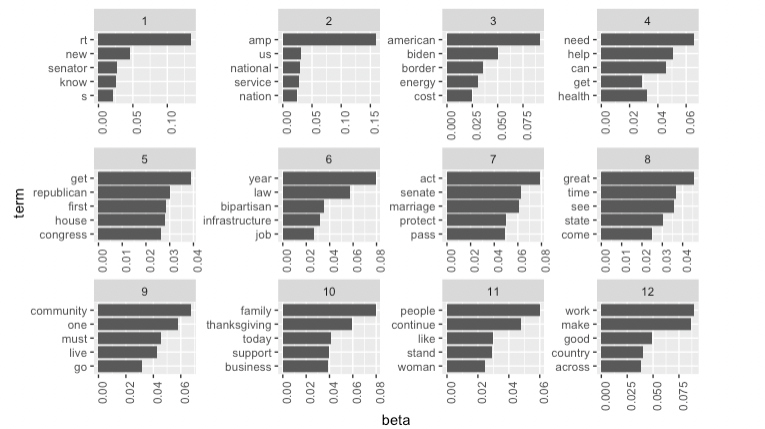

```{r, include = FALSE}
library(knitr)
library(tidyverse)
```

## Introduction

Every year, US Senators vote on bills, usually having multiple votes on a single bill passed. When one party has a majority in the Senate, bills which receive votes only from the majority party may still pass. In these cases, the bills are labeled partisan. When bills pass the Senate with at least one vote from each major party, then the bills are said to be bipartisan. Because the two major parties have different priorities and stances on issues, bills which involve highly contested issues likely require compromises between Senators to achieve a bipartisan vote.

The 117th session of congress, which includes the US House and Senate, began on January 3, 2021. It will end on January 3, 2023. The Democratic party has had a majority in the Senate during this session, however the margin is very close. There are 50 senators who consistently voted with Democrats--either being Democrats themselves, or being independent and caucusing with the Democrats.There were 50 Republican US Senators. This made for a very close margin to pass bills but gave Democrats an advantage to pass bills they favor because the Democratic US Vice President serves as a tie-breaker vote in the Senate. Thus, compromise was not required for many bills, but it was not easy to pass a bill without it.

Throughout the process of drafting, voting on, and publicizing bills, many Senators use Twitter to communicate to the public. Indeed, they Tweet a lot. They talk often about what is going on in Congress and about what they are doing to help the constituents in their state. They also talk about what bills are up for consideration in Congress.

In this paper, I explore what Senators were writing about on Twitter around the time that highly-publicized bills were passed in the 117th session of congress. I then do topic modeling on the text of these Tweets to determine which topics and terms were most prevalent leading up to, and around the passing of bills. Afterward, presenting this data, I explore which topics and terms were present in bills that involved compromise. I define compromise as whether at least one senator from the two major parties voted for a successful bill.

The code and other files involved in this project, can be found in my repository on Github at the URL: https://github.com/joevus/compromise_final_project. 

## Data

I determined bills of interest by selecting important and highly publicized bills. The bills had to be passed by the US Senate. Most had become law by the time of writing this paper. The exception is the Respect for Marriage Act which had not yet been signed into law. I selected these from a list on Ballotpedia's page for the [117th US Congress](https://ballotpedia.org/117th_United_States_Congress). The bills I selected from can be seen in the following table:
 
 |Bill                     | Senate Vote Date | Democrat Yea | Independent Yea | Republican  Yea | Compromise? |
 |-------------------------|--------------|---------|----------|---------|-----------|
 |Respect for Marriage Act of 2022 | 29-Nov-2022 | 47 | 2 | 12 | Y |
 |Inflation Reduction Act of 2022 |7-Aug-2022 | 48 | 2 | 0 | N|
 |Bipartisan Safer Communities Act of 2022 |23-Jun-22 | 48 | 2 | 15 | Y|
 |American Rescue Plan Act of 2021 | 6-Mar-22 | 48 | 2 | 0 | N |
 |Infrastructure Investment and Jobs Act of 2021 | 10-Aug-2021 | 48 | 2 | 19 | Y |

I found the vote counts and vote dates on Ballotpedia as well. It should be noted, that most bills have more than one vote in the Senate as bills go through various modifications and procedures. The vote date here is the last vote the Senate took on a given bill. As seen in the table, three of the bills here involved compromise, while two did not.
 
I accessed Tweets of US Senators for a period of two weeks before the passage of a given bill up some time during the day after the bill was passed. I decided to include the entire day that the bill was passed and a few more hours into the next day to capture what Senators were saying about the bill on the day it passed or soon thereafter.

To pull Senators Tweets, I used the function `get_timeline` from the `rtweet` package. It allowed me to go back over a year in time whereas some other functions only allow a user to access tweets that were no more than several days old (e.g. `lists_statuses`). Below is code I used for gathering Tweets for the Respect for Marriage Act 2022. I used similar code to gather Tweets for the other bills. For a more thorough look into the code I used for this project, see the file `project.Rmd` in the Github repository.

```{r, eval=FALSE}
tweets_from_timeline <- get_timeline(
  user=senator_handles_list,
  max_id = c("1598011580016304128"),
  since_id = c("1592524893316579329")
)
```

The `user` field is populated with `senator_handles_list` which is a list of handles used by US Senators. I created that R vector with the following code:

```{r, eval=FALSE}
members <- lists_members(list_id = 63915645 )
senator_handles_list <- members$screen_name
```

where the `list_id` shown is that of the Twitter list called [US Senate](https://twitter.com/i/lists/63915645) by the TwitterGov account.

The resulting collections of Tweets each included thousands of Tweets.


### Analysis

I used LDA topic modeling to create topic models for five collections of Tweets.

First I created lemma data for use in the LDAs for each collection.

```{r, eval=FALSE}
lemmaData <- read.csv2("baseform_en.tsv", # downloaded from https://github.com/tm4ss/tm4ss.github.io/tree/master/resources
                       sep=",", 
                       header=FALSE, 
                       encoding = "UTF-8", 
                       stringsAsFactors = F)
```

Then I created a corpus for each collection:

```{r, eval=FALSE}
corpus_respect_for_marriage <- corpus(tweets_from_timeline,
                                      docid_field = "id",
                                      text_field= "full_text")

corpus_respect_for_marriage_proc <- tokens(corpus_respect_for_marriage,
                                        remove_punct = TRUE, # remove punctuation
                                        remove_numbers = TRUE, # remove numbers
                                        remove_symbols = TRUE) %>% # remove symbols (for social media data, could remove everything except letters)
                                          tokens_tolower() # remove capitalization


```

```{r,eval=FALSE}
corpus_respect_for_marriage_proc <-  tokens_replace(corpus_respect_for_marriage_proc, # "Substitute token types based on vectorized one-to-one matching"
                                    lemmaData$V1, 
                                    lemmaData$V2,
                                    valuetype = "fixed") 
```

```{r, eval=FALSE}
corpus_respect_for_marriage_proc <- corpus_respect_for_marriage_proc %>%
                             tokens_remove(stopwords("english")) %>%
                             tokens_ngrams(1) 
```

I created the Document Term Matrix. Here is a sample of the code involved:

```{r, eval=FALSE}
#  Create dtm
DTM <- dfm(corpus_respect_for_marriage_proc)
```

Following that, I created the LDA with twelve topics. I used the Gibbs method and included 500 iterations. I then grouped the topic models by top terms and created bar charts with ggplot to visualize the top terms of each of the bills.

I ran out of time to upload all of the images. They will all be included in the Github repo. HEre is the respect for marriage act chart.

```{r}

```


## Discussion

By comparing the results of the bar charts here, we can see which terms show up for compromises more than for bills with no compromise. For example, bipartisan is a word that can be seen in multiple compromise bills.

## References
